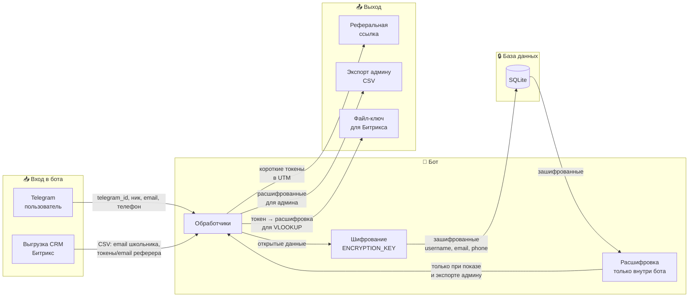

# Блок-схема данных бота (для руководителя)

Кратко: откуда данные приходят, где хранятся и куда уходят. Показано, что персональные данные шифруются и в открытом виде не передаются вовне.

---

## Схема потока данных

---

## Что куда попадает

| Откуда | Куда | Что именно |
|--------|------|------------|
| **Пользователь в Telegram** | Бот | telegram_id, имя, ник, email, телефон (при регистрации) |
| **Бот** | База данных | Всё персональное хранится **только в зашифрованном виде** (ник, email, телефон). Ключ шифрования — в .env на сервере. |
| **Бот** | Реферальная ссылка | В URL подставляются **короткие токены**, а не открытые email/телефон/ник. По ссылке нельзя восстановить контакты. |
| **Сайт / Битрикс** | CRM | В UTM приходят те же **токены**. В выгрузке из Битрикса — токены, а не открытые данные. |
| **Админ** | Импорт CSV | Загружает выгрузку из CRM (email школьника + токены или email/телефон реферера). Бот по ним находит реферера и связывает реферала. |
| **Бот** | Админ (экспорт) | Два файла: (1) пользователи с **расшифрованными** контактами только для админа; (2) файл-ключ «токен → расшифрованное значение» для подстановки в Excel по выгрузке Битрикса. |

---

## Безопасность (кратко)

- **В БД** — только зашифрованные username, email, phone. Без ключа из .env данные не прочитать.
- **В ссылках и в Битриксе** — только короткие токены. По токену нельзя вычислить email или телефон без файла-ключа.
- **Расшифровка** выполняется только внутри бота (показ пользователю, экспорт админу, генерация ключа). Ключ шифрования хранится только в .env на сервере и не отдаётся наружу.

---

*Диаграмму можно открыть в редакторе с поддержкой Mermaid (VS Code, GitHub, Notion) или сконвертировать в PNG для презентации.*
