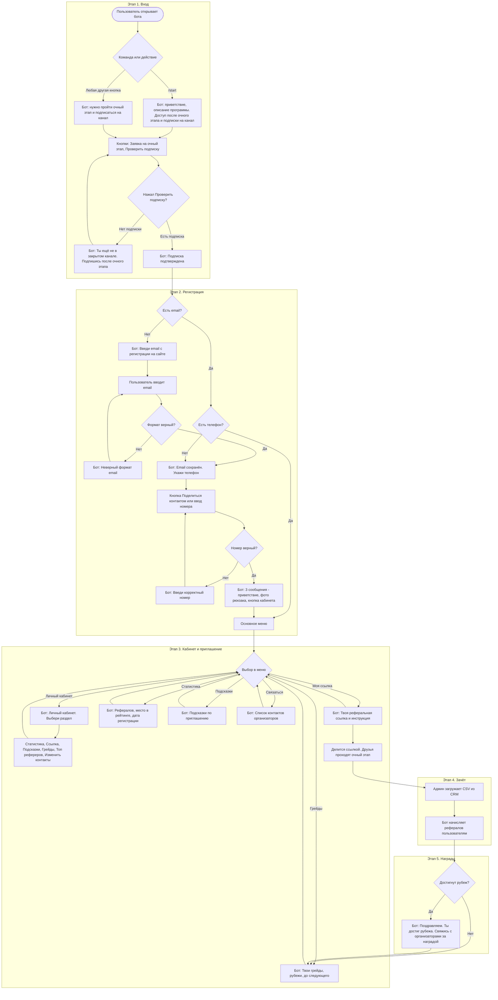
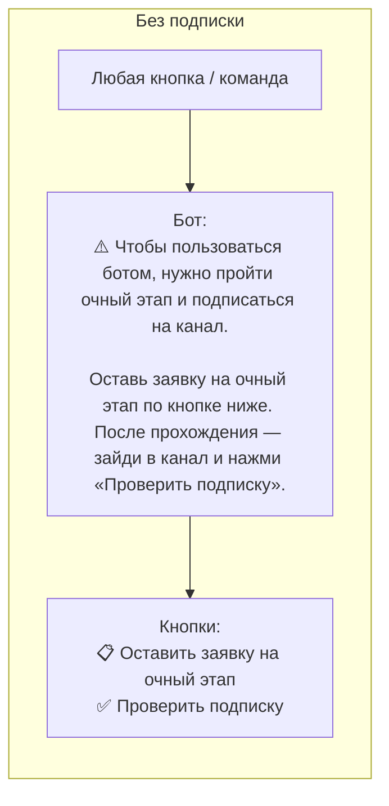
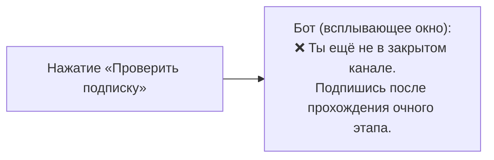
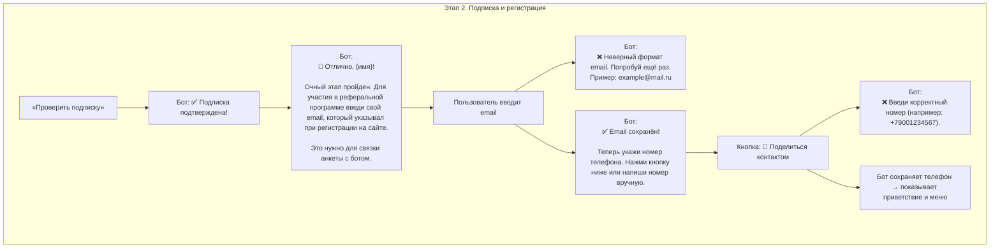
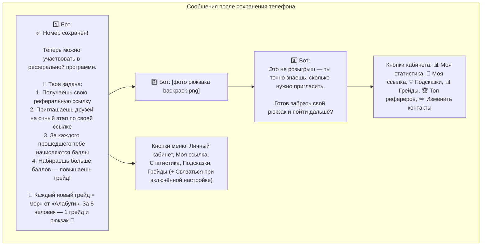
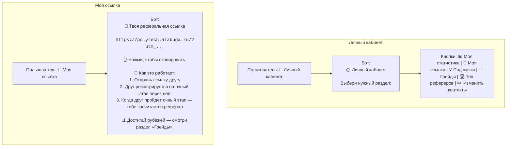
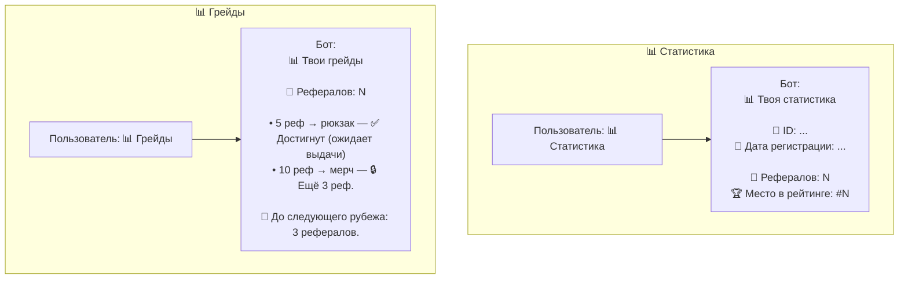
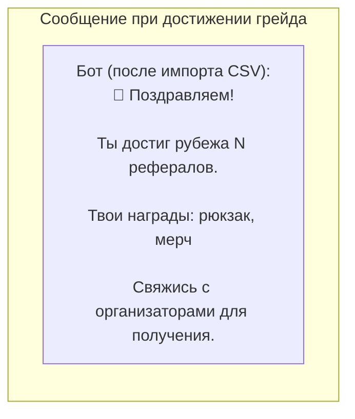
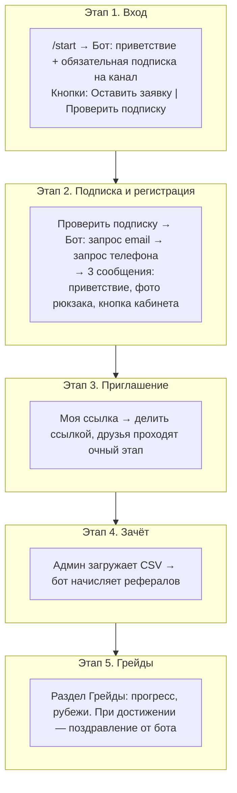

# Блок-схема для пользователя: сообщения бота и этапы

Путь участника показан **блок-схемами** с примерами реальных сообщений бота и кнопок. **Обязательная подписка на канал:** без неё бот не даёт доступ к ссылке и разделам (только заявка на очный этап и проверка подписки).

---

## Единая блок-схема: все этапы и возможности



---

## Этап 1. Вход в бота (без подписки)

Пользователь пишет `/start` и **ещё не подписан** на закрытый канал:

```mermaid
flowchart LR
    subgraph E1[Этап 1. Вход без подписки]
        U1[/start]
        B1[Бот: приветствие и описание программы. Доступ после очного этапа и подписки.]
        K1[Кнопки: Заявка на этап и Проверить подписку]
    end
    U1 --> B1 --> K1
```

Если пользователь **уже подписан** — бот переходит к этапу 2 (регистрация email/телефон или приветствие с кабинетом).

---

## Этап 1 (продолжение). Попытка действия без подписки

Любое действие (например, «Личный кабинет», «Моя ссылка») **без подписки** перехватывается:



При нажатии «Проверить подписку» без подписки:



---

## Этап 2. Подписка подтверждена → регистрация (email, телефон)

После очного этапа пользователь подписывается на канал и нажимает «Проверить подписку»:



---

## Этап 2 (продолжение). После сохранения телефона — три сообщения

После ввода телефона бот отправляет **три сообщения подряд**:



---

## Этап 2 → 3. Личный кабинет и «Моя ссылка»

После регистрации пользователь видит основное меню и может открыть кабинет или ссылку:



---

## Примеры: Статистика и Грейды



---

## Этап 4–5. Зачёт рефералов и уведомление о грейде

Организаторы загружают CSV — бот начисляет рефералов. При достижении рубежа пользователю приходит:



---

## Общая схема этапов (кратко)



---

*Диаграммы построены по реальным текстам из бота (`start.py`, `cabinet.py`, `grade.py`, `middlewares/subscription.py`). Открыть в редакторе с поддержкой Mermaid или на GitHub.*
